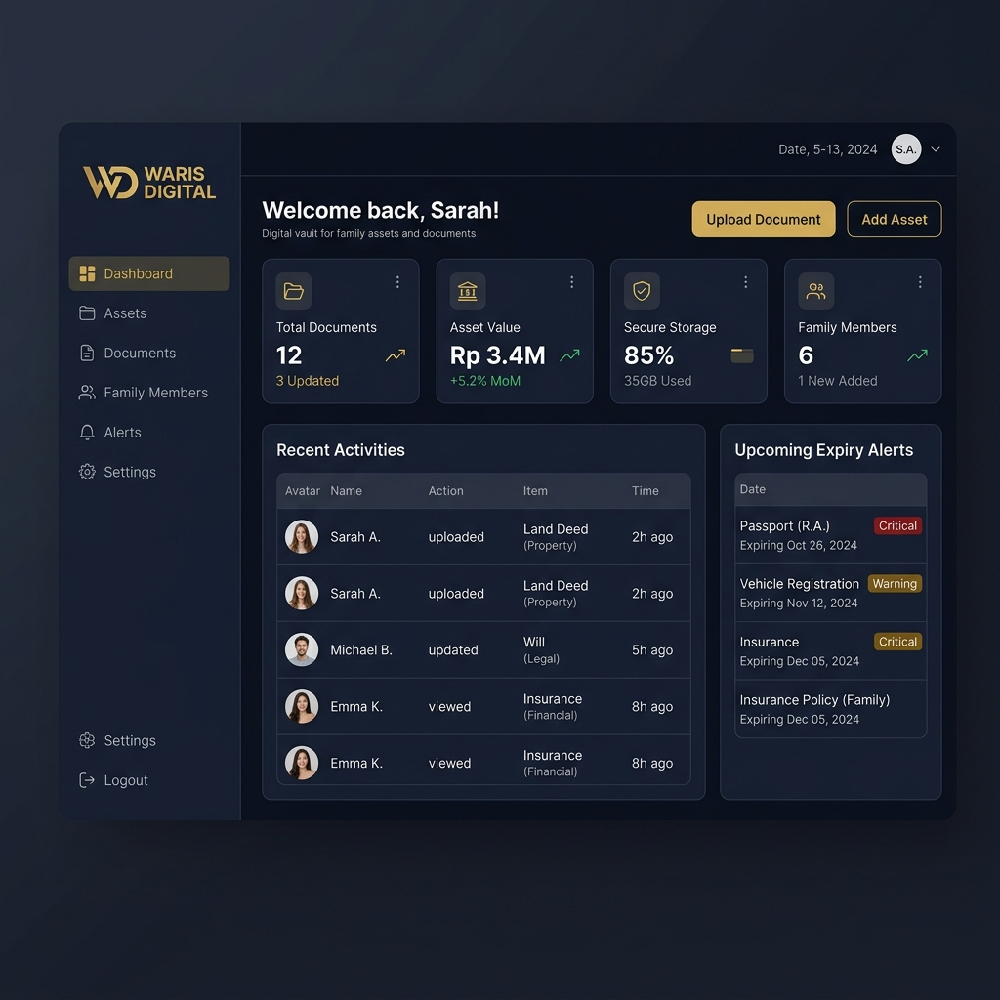

# WarisDigital — Brankas Digital Keluarga Indonesia

WarisDigital adalah sebuah platform digital berbasis web yang dirancang khusus untuk membantu keluarga Indonesia menyimpan, mengelola, dan mewariskan aset serta dokumen penting secara aman, terstruktur, dan terenkripsi.



---

## Deskripsi Singkat Aplikasi

WarisDigital bertindak sebagai **"Brankas Digital Keluarga"** yang tersentralisasi. Aplikasi ini memfasilitasi kepala keluarga untuk mengorganisir seluruh dokumen identitas, sertifikat tanah, BPKB, aset keuangan, dan wasiat digital mereka dalam satu dasbor terpadu. Anggota keluarga yang berhak (ahli waris) dapat diberikan akses berjenjang yang aman sehingga meminimalkan risiko sengketa atau hilangnya rekam jejak aset keluarga di masa depan.

---

## Tujuan Pengembangan Aplikasi

1. **Catatan Aset Terpusat**: Membantu meminimalkan risiko data aset yang hilang atau terlupa karena dokumen berserakan.
2. **Ketenangan Administratif**: Mengantisipasi terjadinya sengketa perdata/waris dengan menyajikan informasi kepemilikan aset yang transparan.
3. **Pewarisan Legacy yang Mulus**: Membantu proses balik nama dan pencarian riwayat aset keluarga secara akurat bagi ahli waris.
4. **Pendidikan Perhitungan Waris**: Menyediakan kalkulator simulasi pembagian waris yang edukatif sesuai hukum Islam (faraid), perdata, maupun adat.

---

## Daftar Fitur yang Tersedia

- 📁 **Vault Dokumen**: Unggah dokumen penting (PDF, JPG, PNG) dengan enkripsi lokal. Mengelompokkan dokumen berdasarkan kategori (Identitas, Properti, Kendaraan, Keuangan).
- 🗺️ **Aset Mapper**: Daftarkan data aset keluarga berupa properti, kendaraan, tabungan, investasi beserta nominal estimasi nilai.
- 👥 **Akses Berjenjang**: Memberikan hak akses spesifik (`view`, `download`, `edit`) atas dokumen tertentu kepada pengguna/anggota keluarga terdaftar lainnya.
- ⏰ **Pengingat Dokumen**: Alert pengingat otomatis (countdown hari) sebelum dokumen penting kedaluwarsa (misalnya KTP, Paspor, SIM, dll.).
- ⏳ **Kapsul Waktu (Time Capsule)**: Simpan pesan, video, atau dokumen sensitif yang hanya bisa dibuka saat kondisi tertentu terpenuhi (tanggal tertentu, manual unlock, atau verifikasi kematian).
- ⚖️ **Simulasi Waris**: Kalkulator interaktif untuk menghitung pembagian waris secara otomatis berdasarkan porsi hukum Islam (Faraid) maupun hukum perdata/adat.
- 🤝 **Mitra Notaris**: Cari notaris terverifikasi di berbagai kota/provinsi untuk membantu legalitas dokumen resmi.
- 📋 **Panduan Klaim**: Panduan langkah-demi-langkah pengurusan klaim per institusi (bank, BPN, asuransi, dll.).

---

## Teknologi, Framework, Library, dan Komponen

- **Backend**: Laravel 11.x (PHP 8.3+)
- **Frontend**: Vue 3 (Composition API) + Inertia.js (Single Page Application)
- **Styling**: Tailwind CSS v4.0 + Custom CSS WarisDigital
- **Database**: SQLite (Koneksi lokal dan self-contained database)
- **Build Tool**: Vite v8.0
- **Auth**: Laravel Sanctum (Authentication Guard bawaan session-based)

---

## Struktur Database (SQLite)

Database menggunakan relasi model Eloquent dengan skema tabel sebagai berikut:

### 1. `users`
Tabel penyimpan data pengguna utama.
*   `id` (Bigint, Primary Key)
*   `name` (Varchar) — Nama Lengkap
*   `email` (Varchar, Unique) — Alamat Email
*   `password` (Varchar) — Password terenkripsi
*   `remember_token` (Varchar, Nullable)
*   `timestamps` (created_at, updated_at)

### 2. `documents`
Tabel penyimpanan metadata berkas vault dokumen.
*   `id` (Bigint, Primary Key)
*   `user_id` (Bigint, Foreign Key -> `users`) — Pemilik dokumen
*   `title` (Varchar) — Nama dokumen
*   `description` (Text, Nullable)
*   `file_path` (Varchar) — Path penyimpanan file lokal
*   `file_type` (Varchar, Nullable) — Kategori dokumen (Identitas/Properti/Keuangan/Kendaraan/Lainnya)
*   `file_size` (Integer, Nullable) — Ukuran file dalam bytes
*   `is_encrypted` (Boolean) — Status enkripsi berkas
*   `timestamps` (created_at, updated_at)

### 3. `assets`
Tabel pendataan aset keluarga.
*   `id` (Bigint, Primary Key)
*   `user_id` (Bigint, Foreign Key -> `users`)
*   `name` (Varchar) — Nama aset
*   `type` (Varchar) — Tipe aset (tanah, rumah, kendaraan, tabungan, investasi, lainnya)
*   `description` (Text, Nullable)
*   `value` (Decimal) — Estimasi nilai aset (Rupiah)
*   `location` (Text, Nullable) — Lokasi fisik aset
*   `latitude` / `longitude` (Decimal, Nullable)
*   `document_id` (Bigint, Foreign Key -> `documents`, Nullable) — Dokumen penunjang aset
*   `is_active` (Boolean) — Status keaktifan aset
*   `timestamps` (created_at, updated_at)

### 4. `access_permissions`
Tabel pengatur izin akses berjenjang atas dokumen.
*   `id` (Bigint, Primary Key)
*   `document_id` (Bigint, Foreign Key -> `documents`)
*   `user_id` (Bigint, Foreign Key -> `users`) — Pengguna penerima izin
*   `permission` (Varchar) — Tingkatan izin (view, download, edit)
*   `timestamps` (created_at, updated_at)

### 5. `reminders`
Tabel pengingat jatuh tempo dokumen.
*   `id` (Bigint, Primary Key)
*   `user_id` (Bigint, Foreign Key -> `users`)
*   `document_id` (Bigint, Foreign Key -> `documents`, Nullable)
*   `title` (Varchar) — Judul pengingat
*   `message` (Text, Nullable)
*   `remind_at` (Timestamp) — Tanggal pengingat
*   `is_sent` (Boolean) — Status keteririman
*   `timestamps` (created_at, updated_at)

### 6. `time_capsules`
Tabel kapsul waktu digital.
*   `id` (Bigint, Primary Key)
*   `user_id` (Bigint, Foreign Key -> `users`)
*   `title` (Varchar) — Judul kapsul waktu
*   `message` (Text, Nullable)
*   `document_id` (Bigint, Foreign Key -> `documents`, Nullable)
*   `unlock_at` (Timestamp, Nullable) — Waktu pelepasan (untuk kondisi date)
*   `unlock_condition` (Varchar) — Kondisi pembukaan (date, death, manual)
*   `is_unlocked` (Boolean) — Status kapsul (apakah sudah terbuka)
*   `timestamps` (created_at, updated_at)

### 7. `notaries`
Tabel daftar mitra notaris resmi.
*   `id` (Bigint, Primary Key)
*   `name` (Varchar) — Nama notaris
*   `email` (Varchar)
*   `phone` (Varchar)
*   `address` (Text)
*   `city` / `province` (Varchar)
*   `license_number` (Varchar)
*   `specialization` (Varchar)
*   `is_verified` (Boolean)
*   `rating` (Decimal)
*   `review_count` (Integer)
*   `timestamps` (created_at, updated_at)

### 8. `claim_guides`
Tabel panduan pengurusan dokumen.
*   `id` (Bigint, Primary Key)
*   `institution_type` (Varchar)
*   `title` (Varchar)
*   `steps` (JSON) — Array tahapan pengurusan
*   `timestamps` (created_at, updated_at)

### 9. `inheritances`
Tabel hasil simulasi waris.
*   `id` (Bigint, Primary Key)
*   `user_id` (Bigint, Foreign Key -> `users`)
*   `title` (Varchar) — Judul simulasi
*   `total_assets` (Decimal) — Total nilai harta yang disimulasikan
*   `law_type` (Varchar) — Pilihan hukum waris (islam, perdata, adat)
*   `heirs` (JSON) — Daftar nama & relasi ahli waris
*   `result` (JSON) — Hasil perhitungan pembagian
*   `timestamps` (created_at, updated_at)

---

## Panduan Instalasi dan Menjalankan Aplikasi

Aplikasi berjalan sepenuhnya secara lokal menggunakan basis data SQLite. Ikuti langkah-langkah di bawah ini untuk memasang dan menjalankan aplikasi:

### Prasyarat
- **PHP** versi 8.3 ke atas (aktifkan ekstensi `pdo_sqlite` dan `sqlite3` di php.ini).
- **Composer** untuk manajemen dependensi PHP.
- **Node.js** & **npm** untuk kompilasi asset frontend.

### Langkah-Langkah Pemasangan

1.  **Clone atau Unduh Proyek** ke direktori lokal Anda.
2.  **Instal Dependensi Backend (Composer)**:
    ```bash
    composer install
    ```
3.  **Instal Dependensi Frontend (npm)**:
    ```bash
    npm install
    ```
4.  **Siapkan Berkas Environment**:
    Salin file `.env.example` menjadi `.env`:
    ```bash
    cp .env.example .env
    ```
    Pastikan `DB_CONNECTION` diset ke `sqlite`:
    ```ini
    DB_CONNECTION=sqlite
    ```
5.  **Buat File Database SQLite**:
    Laravel akan otomatis membuat file database jika belum ada, atau Anda dapat membuatnya secara manual:
    ```bash
    touch database/database.sqlite
    ```
6.  **Jalankan Generate Key**:
    ```bash
    php artisan key:generate
    ```
7.  **Jalankan Migrasi & Seeder Database**:
    ```bash
    php artisan migrate:fresh --seed
    ```
    *Seeder default akan membuat dua pengguna uji:*
    -   Email: `test@example.com`
    -   Password: `password`

### Menjalankan Aplikasi di Lokal

Jalankan server pengembangan Laravel backend dan Vite development server secara bersamaan dengan satu perintah praktis:
```bash
npm run dev
```

Atau secara terpisah:
-   **Terminal 1 (Backend)**:
    ```bash
    php artisan serve
    ```
-   **Terminal 2 (Frontend/Vite)**:
    ```bash
    npm run dev
    ```

Buka peramban (browser) dan akses alamat berikut:
**[http://127.0.0.1:8000](http://127.0.0.1:8000)**
